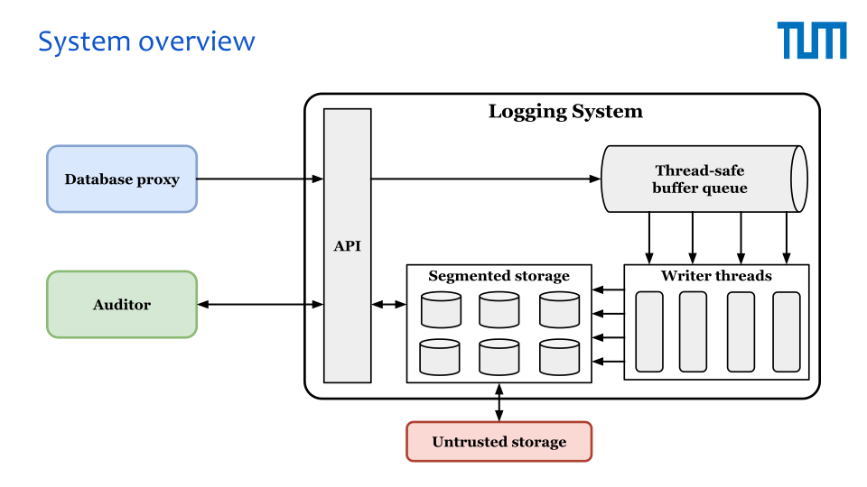
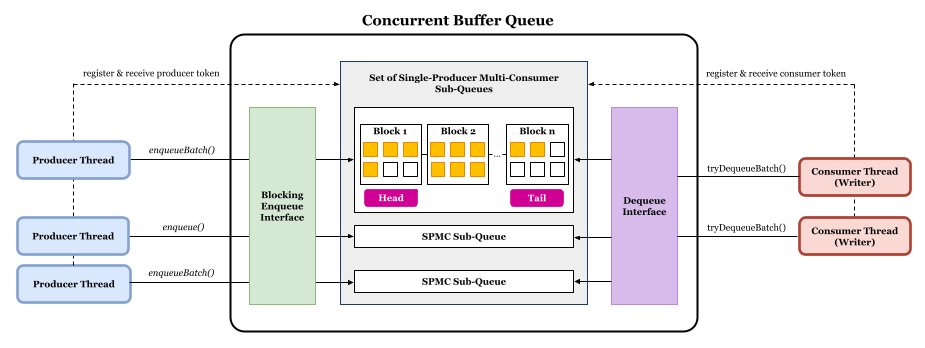
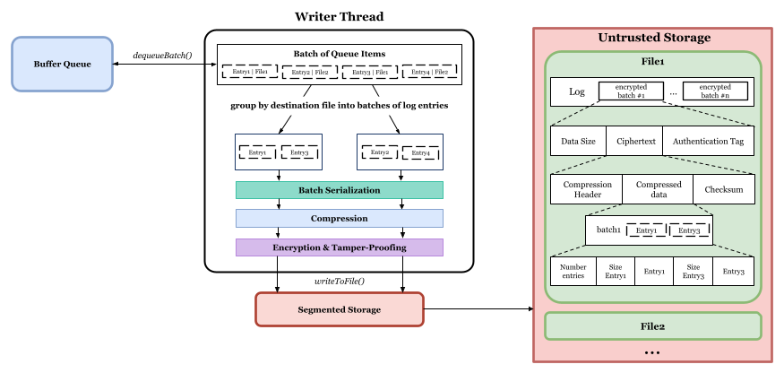
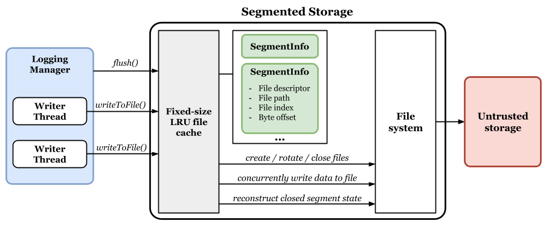
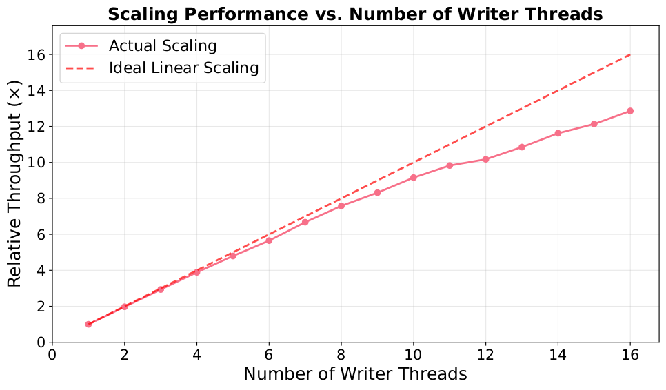

# Secure and Tamperproof Logging System for GDPR-compliant Key-Value Stores

## Overview

This bachelor thesis presents a **secure**, **tamper-evident**, **performant** and **modular** logging system for GDPR compliance.
Its impact lies in:

- Enabling verifiable audit trails with minimal integration effort
- Supporting GDPR accountability with high performance
- Laying the groundwork for future improvements (e.g. key management)

For an in-depth explanation of the design, implementation, and evaluation, please refer to the full [bachelor thesis](https://github.com/TUM-DSE/research-work-archive/blob/main/archive/2025/summer/docs/bsc_karidas.pdf) or the accompanying [presentation slides](https://github.com/TUM-DSE/research-work-archive/blob/main/archive/2025/summer/talks/bsc_karidas.pdf).



**Key features** include:

- **Asynchronous batch logging** to minimize client-side latency.
- **Lock-free, multi-threaded architecture** for high concurrent throughput.
- **Compression before encryption** to reduce I/O overhead and storage costs.
- **Authenticated encryption (AES-GCM)** to ensure confidentiality and integrity.
- **Immutable, append-only storage** for compliance and auditability.
- **GDPR subject-access export** to NDJSON with optional time-range and subject-ID filtering.

## Security Scope and Limitations

The implementation is the artifact of a bachelor thesis focused on the system's architecture and performance; a few security-critical building blocks are deliberately placeholders and are **out of scope** for the current codebase:

- **Key management is not implemented.** The writer path in [src/Writer.cpp](src/Writer.cpp) uses a hardcoded placeholder key and a static IV. This is _not_ cryptographically secure — reusing an IV with AES-GCM under the same key breaks the authentication guarantee. A production deployment must load the key from an external KMS or configuration and generate a fresh random IV per batch.
- **No Additional Authenticated Data (AAD).** Segment metadata (filename, segment index, batch sequence) is not bound to the ciphertext. The "tamper-evident" property below therefore applies **per encrypted batch**, not across batches: an attacker with access to the log directory can reorder, replay, or truncate entire batches without the system detecting it. Binding segment metadata as AAD would close this gap.
- **Tamper detection.** What _is_ guaranteed today: AES-GCM's per-batch authentication tag detects any bit-flip, truncation, or substitution within a single encrypted batch. Read-back (via `Crypto::decrypt`) raises `TamperDetectedException` on any such modification (see [tests/integration/test_RoundTrip.cpp](tests/integration/test_RoundTrip.cpp)). `LoggingManager::exportLogs` aborts with an error and deletes any partial output file on tag failure, so a tampered log cannot masquerade as a valid export.
- **Export requires the system to be stopped.** `LoggingManager::exportLogs` must be called after `stop()`; it rejects calls while writers are active. This avoids partial-last-batch ambiguity and races against an in-flight rotation, at the cost of no live subject-access export. A streaming or snapshot-based concurrent export is left as future work.

## Setup and Usage

### Prerequisites

- C++17 compatible compiler (GCC 9+ or Clang 10+)
- CMake 3.15 or higher
- Git (for submodule management)

### Dependencies

Make sure the following libraries are available on your system:

- OpenSSL - For cryptographic operations (AES-GCM encryption)
- ZLIB - For compression functionality
- Google Test (GTest) - For running unit and integration tests

Install them on your platform:

- **macOS (Homebrew):**
  ```bash
  brew install cmake openssl googletest
  ```
- **Debian / Ubuntu:**
  ```bash
  sudo apt-get install build-essential cmake libssl-dev zlib1g-dev libgtest-dev
  ```
- **Nix:** the included [shell.nix](shell.nix) provides everything — just run `nix-shell`.

### Building the System

1. **Clone the repository with submodules:**

   ```bash
   git clone --recursive <repository-url>
   ```

2. **If not cloned with `--recursive`, initialize submodules manually:**

   ```bash
   git submodule update --init --recursive
   ```

3. **Configure and build:**
   ```bash
   mkdir build
   cd build
   cmake ..
   make -j$(nproc 2>/dev/null || sysctl -n hw.logicalcpu)
   ```
   The `nproc`/`sysctl` fallback picks the right job count on Linux or macOS. On macOS you can alternatively run `make -j$(sysctl -n hw.logicalcpu)` directly.

### Running the System

A simple usage example is provided in `/examples/main.cpp` that demonstrates how to integrate and use the logging system:

```bash
# Run the usage example
./logging_example
```

#### Exporting logs

After stopping the system, `LoggingManager::exportLogs` emits NDJSON (one entry per line):

```cpp
LoggingManager mgr(cfg);
mgr.start();
// ... produce entries ...
mgr.stop();

// Export every entry for subject "subj_42":
mgr.exportLogs("audit.ndjson",
               std::chrono::system_clock::time_point(),   // from: unbounded
               std::chrono::system_clock::time_point(),   // to:   unbounded
               std::string("subj_42"));
```

Export requires `useEncryption = true` (the on-disk format is only self-framed under encryption) and the system to be stopped. Any AES-GCM tag failure aborts the export and removes the partial output file.

#### Running Tests

```bash
# Run all tests
ctest

# Or run specific tests
./test_<component>
```

### Development Environment (Optional)

A reproducible environment is provided using Nix:

```bash
nix-shell
```

## System Workflow

1. **Log Entry Submission**: When a database proxy intercepts a request to the underlying database involving personal data, it generates a structured log entry containing metadata such as operation type, key identifier, and timestamp. This entry is submitted to the logging API.
2. **Enqueuing**: Log entries are immediately enqueued into a thread-safe buffer, allowing the calling process to proceed without blocking on disk I/O or encryption tasks.
3. **Batch Processing**: Dedicated writer threads continuously monitor the queue, dequeueing entries in bulk for optimized batch processing. Batched entries undergo serialization, compression and authenticated encryption (AES-GCM) for both confidentiality and integrity.
4. **Persistent Storage**: Encrypted batches are concurrently written to append-only segment files. When a segment reaches its configured size limit, a new segment is automatically created.
5. **Export and Verification**: After the system is stopped, `LoggingManager::exportLogs` walks the segment directory, decrypts each batch, decompresses, deserializes, and emits the plaintext entries as NDJSON (one JSON object per line, payload bytes base64-encoded). The export can be narrowed with a time range and an optional `dataSubjectId` for GDPR Article 15 subject-access requests. AES-GCM tag failure during decryption aborts the export and removes the partial output file. Cross-batch verification chaining (detecting whole-batch reorder/replay/truncation) remains future work.

## Design Details

### Concurrent Thread-Safe Buffer Queue

The buffer queue is a lock-free, high-throughput structure composed of multiple single-producer, multi-consumer (SPMC) sub-queues. Each producer thread is assigned its own sub-queue, eliminating contention and maximizing cache locality. Writer threads use round-robin scanning with consumer tokens to fairly and efficiently drain entries. The queue supports both blocking and batch-based enqueue/dequeue operations, enabling smooth operation under load and predictable performance in concurrent environments. This component is built upon [moodycamel's ConcurrentQueue](https://github.com/cameron314/concurrentqueue), a well-known C++ queue library designed for high-performance multi-threaded scenarios. It has been adapted to fit the blocking enqueue requirements by this system.



### Writer Thread

Writer threads asynchronously consume entries from the buffer, group them by destination, and apply a multi-stage processing pipeline: serialization, compression, authenticated encryption (AES-GCM), and persistent write. Each writer operates independently and coordinates concurrent access to log files using atomic file offset reservations, thus minimizing synchronization overhead.



### Segmented Storage

The segmented storage component provides append-only, immutable log files with support for concurrent writers. Files are rotated once a configurable size threshold is reached, and access is optimized via an LRU-based file descriptor cache. Threads reserve byte ranges atomically before writing, ensuring data consistency without locking. This design supports scalable audit logging while balancing durability, performance, and resource usage.



## Benchmarks

To evaluate performance under realistic heavy-load conditions, the system was benchmarked on the following hardware:

- **CPU**: 2× Intel Xeon Gold 6236 (32 cores, 64 threads)
- **Memory**: 320 GiB DDR4-3200 ECC
- **Storage**: Intel S4510 SSD (960 GB)
- **OS**: NixOS 24.11, ZFS filesystem
- **Execution Model**: NUMA-optimized (pinned to a single node)

### Scalability benchmark

To evaluate parallel scalability, a proportional-load benchmark was conducted where the number of producer and writer threads was scaled together from 1 to 16, resulting in an input data volume that grew linearly with thread count.

#### Configuration Highlights

- **Thread scaling**: 1–16 producers and 1–16 writers
- **Entries per Producer**: 2,000,000
- **Entry size**: ~4 KiB
- **Total data at 16× scale**: ~125 GiB
- **Writer Batch Size**: 2048 entries
- **Producer Batch Size**: 4096 entries
- **Queue Capacity**: 2,000,000 entries
- **Encryption**: Enabled
- **Compression**: Level 4 (balanced-fast)



#### Results Summary

The system was executed on a single NUMA node with **16 physical cores**. At **16 total threads** (8 producers + 8 writers), the system achieved **95% scaling efficiency**, demonstrating near-ideal parallelism. Even beyond this point—up to **32 total threads**—the system continued to deliver strong throughput gains by leveraging hyperthreading, reaching approximately **80% scaling efficiency** at full utilization. This shows the system maintains solid performance even under increased CPU contention.

### Main benchmark

#### Workload Configuration

- **Producers**: 16 asynchronous log producers
- **Entries per Producer**: 2,000,000
- **Entry Size**: ~4 KiB
- **Total Input Volume**: ~125 GiB
- **Writer Batch Size**: 2048 entries
- **Producer Batch Size**: 4096 entries
- **Queue Capacity**: 2,000,000 entries
- **Encryption**: Enabled
- **Compression**: Level 1, fast

#### Results

| **Metric**                  | **Value**                                    |
| --------------------------- | -------------------------------------------- |
| **Execution Time**          | 59.95 seconds                                |
| **Throughput (Entries)**    | 533,711 entries/sec                          |
| **Throughput (Data)**       | 2.08 GiB/sec                                 |
| **Latency**                 | Median: 54.7 ms, Avg: 55.9 ms, Max: 182.7 ms |
| **Write Amplification**     | 0.109                                        |
| **Final Storage Footprint** | 13.62 GiB for 124.6 GiB input                |

These results demonstrate the system’s ability to sustain high-throughput logging with low latency and low storage overhead, even under encryption and compression.
