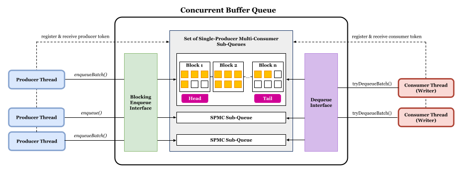
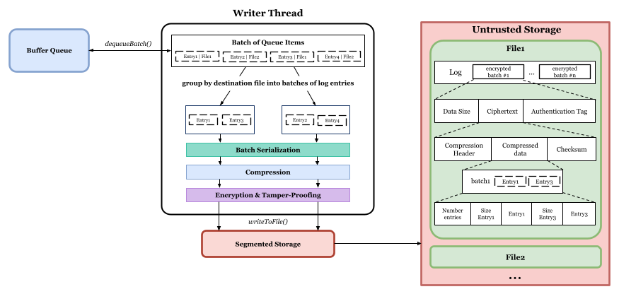
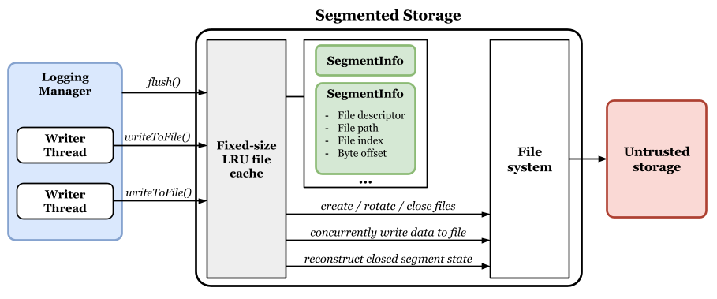
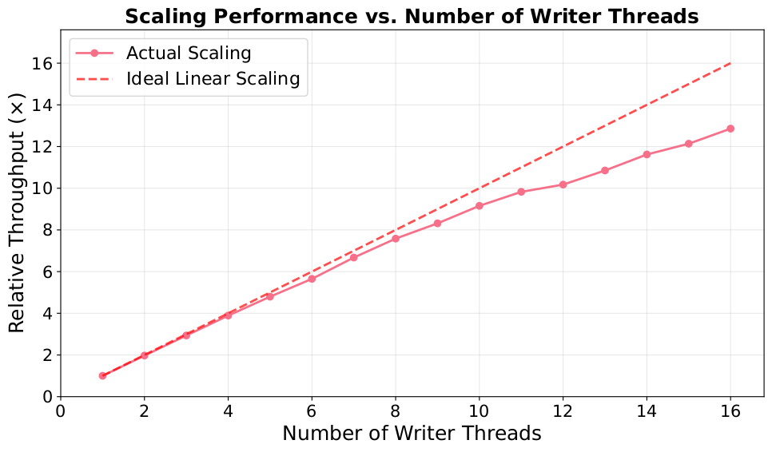

# Secure and Tamperproof Logging System for GDPR-compliant Key-Value Stores

## Overview

This bachelor thesis presents a **secure**, **tamper-evident**, **performant** and **modular** logging system for GDPR compliance.
Its impact lies in:

- Enabling verifiable audit trails with minimal integration effort
- Supporting GDPR accountability with high performance
- Laying the groundwork for future improvements (e.g. key management, export)

**Key features** include:

- **Asynchronous batch logging** to minimize client-side latency.
- **Lock-free, multi-threaded architecture** for high concurrent throughput.
- **Compression before encryption** to reduce I/O overhead and storage costs.
- **Authenticated encryption (AES-GCM)** to ensure confidentiality and integrity.
- **Immutable, append-only storage** for compliance and auditability.
- **Future-proof design** prepared for secure export and verification support.

### System Workflow

1. **Log Entry Submission**: When a database proxy intercepts a request to the underlying database involving personal data, it generates a structured log entry containing metadata such as operation type, key identifier, and timestamp. This entry is submitted to the logging API.
2. **Enqueuing**: Log entries are immediately enqueued into a thread-safe buffer, allowing the calling process to proceed without blocking on disk I/O or encryption tasks.
3. **Batch Processing**: Dedicated writer threads continuously monitor the queue, dequeueing entries in bulk for optimized batch processing. Batched entries undergo serialization, compression and authenticated encryption (AES-GCM) for both confidentiality and integrity.
4. **Persistent Storage**: Encrypted batches are concurrently written to append-only segment files. When a segment reaches its configured size limit, a new segment is automatically created.
5. **Export and Verification**: _(Planned)_: Closed segments can be exported for audit purposes. The export process involves decryption, decompression, and verification of batch-level integrity using authentication tags and cryptographic chaining.

## Design Details

### Concurrent Thread-Safe Buffer Queue

The buffer queue is a lock-free, high-throughput structure composed of multiple single-producer, multi-consumer (SPMC) sub-queues. Each producer thread is assigned its own sub-queue, eliminating contention and maximizing cache locality. Writer threads use round-robin scanning with consumer tokens to fairly and efficiently drain entries. The queue supports both blocking and batch-based enqueue/dequeue operations, enabling smooth operation under load and predictable performance in concurrent environments. This component is built upon [moodycamel's ConcurrentQueue](https://github.com/cameron314/concurrentqueue), a well-known C++ queue library designed for high-performance multi-threaded scenarios. It has been adapted to fit the blocking enqueue requirements by this system.

### Writer Thread

Writer threads asynchronously consume entries from the buffer, group them by destination, and apply a multi-stage processing pipeline: serialization, compression, authenticated encryption (AES-GCM), and persistent write. Each writer operates independently and coordinates concurrent access to log files using atomic file offset reservations, thus minimizing synchronization overhead.

### Segmented Storage

The segmented storage component provides append-only, immutable log files with support for concurrent writers. Files are rotated once a configurable size threshold is reached, and access is optimized via an LRU-based file descriptor cache. Threads reserve byte ranges atomically before writing, ensuring data consistency without locking. This design supports scalable audit logging while balancing durability, performance, and resource usage.

## Benchmarks

To evaluate performance under realistic heavy-load conditions, the system was benchmarked on the following hardware:

- **CPU**: 2× Intel Xeon Gold 6236 (32 cores, 64 threads)
- **Memory**: 320 GiB DDR4-3200 ECC
- **Storage**: Intel S4510 SSD (960 GB)
- **OS**: NixOS 24.11, ZFS filesystem
- **Execution Model**: NUMA-optimized (pinned to a single node)

### Scalability benchmark

To evaluate parallel scalability, a proportional-load benchmark was conducted where the number of producer and writer threads was scaled together from 1 to 16, resulting in an input data volume that grew linearly with thread count.

#### Configuration Highlights

- **Thread scaling**: 1–16 producers and 1–16 writers
- **Entries per Producer**: 2,000,000
- **Entry size**: ~4 KiB
- **Total data at 16× scale**: ~125 GiB
- **Writer Batch Size**: 2048 entries
- **Producer Batch Size**: 4096 entries
- **Queue Capacity**: 2,000,000 entries
- **Encryption**: Enabled
- **Compression**: Level 4 (balanced-fast)

#### Results Summary

The system was executed on a single NUMA node with **16 physical cores**. At **16 total threads** (8 producers + 8 writers), the system achieved **95% scaling efficiency**, demonstrating near-ideal parallelism. Even beyond this point—up to **32 total threads**—the system continued to deliver strong throughput gains by leveraging hyperthreading, reaching approximately **80% scaling efficiency** at full utilization. This shows the system maintains solid performance even under increased CPU contention.

### Main benchmark

#### Workload Configuration

- **Producers**: 16 asynchronous log producers
- **Entries per Producer**: 2,000,000
- **Entry Size**: ~4 KiB
- **Total Input Volume**: ~125 GiB
- **Writer Batch Size**: 2048 entries
- **Producer Batch Size**: 4096 entries
- **Queue Capacity**: 2,000,000 entries
- **Encryption**: Enabled
- **Compression**: Level 1, fast

#### Results

| **Metric**                  | **Value**                                    |
| --------------------------- | -------------------------------------------- |
| **Execution Time**          | 59.95 seconds                                |
| **Throughput (Entries)**    | 533,711 entries/sec                          |
| **Throughput (Data)**       | 2.08 GiB/sec                                 |
| **Latency**                 | Median: 54.7 ms, Avg: 55.9 ms, Max: 182.7 ms |
| **Write Amplification**     | 0.109                                        |
| **Final Storage Footprint** | 13.62 GiB for 124.6 GiB input                |

These results demonstrate the system’s ability to sustain high-throughput logging with low latency and low storage overhead, even under encryption and compression.
